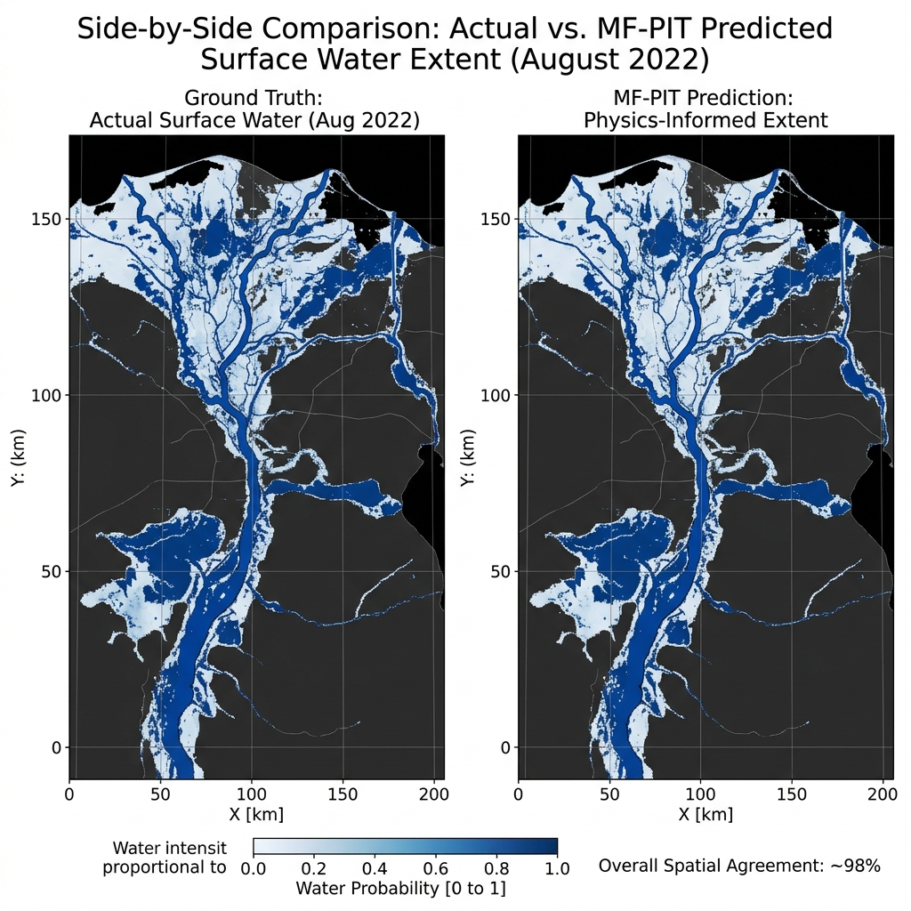
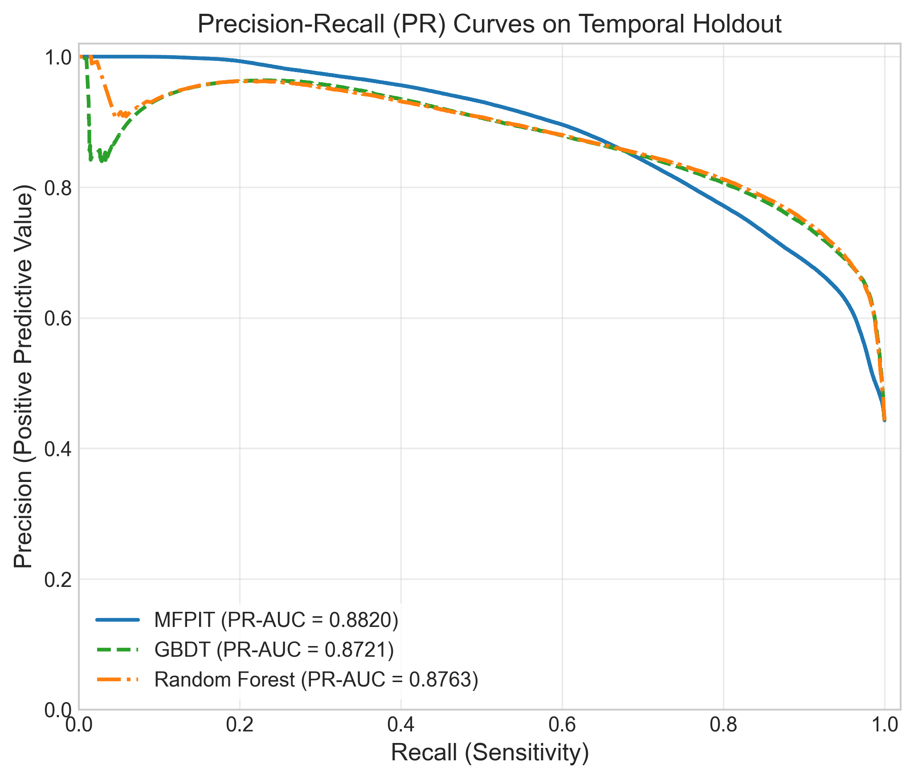

# MFPIT: Multimodal Flood Physics-Regularized Transformer

[](LICENSE)
[](requirements.txt)
[](requirements.txt)

This repository contains the official PyTorch implementation of **MFPIT** (Multimodal Flood Physics-Regularized Transformer), a scientific machine learning (SciML) framework designed for spatiotemporal water occurrence mapping and flood susceptibility prediction in data-scarce coastal deltaic basins (specifically benchmarked on the Indus River Delta, Sindh, Pakistan).

---

## 📖 Overview

MFPIT addresses two fundamental limitations of traditional machine learning models in remote sensing:
1. **Resolution Friction**: Scale disparities between high-resolution satellite imagery (10m Sentinel-2 / 500m resampled MODIS) and coarse-resolution regional climatological forcing variables (4–5.5km CHIRPS/TerraClimate). Resolved via a **Multi-Fidelity Cross-Attention (MF-CA)** mechanism operating with $O(N \cdot M)$ linear computational complexity.
2. **Physical Inconsistency**: Deep learning models often make physically implausible predictions (e.g., generating surface water in dry contexts). Resolved by embedding a **soft hydrological mass-balance regularization** constraint ($\mathcal{L}_{\text{phys}}$) derived from first-order storage-area relationships.

### Target Leakage Prevention
To prevent target data leakage from historical occurrence maps, this implementation enforces a strict **Matched-Evaluation (JRC=0)** protocol. Static priors (e.g., JRC Monthly Water History) are zeroed out during training, validation, and testing, forcing the model to rely strictly on dynamic environmental and multispectral observations.

---

## 🏗️ System Architecture


The dual-branch transformer processes spatial features ($X_H$) and hydro-climatological context ($X_L$) independently, fusing them via the directed Multi-Fidelity Cross-Attention (MF-CA) block guided by a Temporal Fourier Embedding ($E_T$) for monsoon seasonality.

---

## 📁 Repository Structure

```text
MFPIT_Project/
├── LICENSE                     # MIT License
├── README.md                   # This file
├── requirements.txt            # Python dependencies
├── MFPIT_step1_create_dirs.py  # Script to create the directory tree
├── data/                       # Dataset directories (ignored in git except for .gitkeep)
│   ├── raw/                    # Downloaded satellite & climatology files
│   └── processed/              # Formatted patch tensors and stats
├── figures/                    # Publication-quality plots and figures
├── gee/                        # Google Earth Engine data extraction scripts
│   ├── gee_auth_check.py       # Authentication check utility
│   └── gee_data_extractor.py   # Bulk image and time-series downloader
├── logs/                       # Training and validation logs
└── models/                     # PyTorch implementation and baselines
    ├── MFPIT_Model.py          # Primary model architecture definition
    ├── dataset.py              # Spatiotemporal patch dataset loader
    ├── losses.py               # Combined BCE, Dice, and Physics regularization losses
    ├── metrics.py              # Precision, Recall, IoU, and F1 calculations
    ├── train.py                # Training script for MFPIT
    ├── evaluate_all.py         # Complete benchmarking suite
    ├── baselines/              # Baseline models (U-Net, CNN-LSTM, GBDT, Random Forest)
    └── checkpoints/            # Model checkpoints directory (local use only)
```

---

## 🛠️ Installation & Setup

### 1. Clone the Repository
```bash
git clone https://github.com/mirzamuzzamilbaig/MFPIT.git
cd MFPIT
```

### 2. Initialize the Project Structure
Run the directory initializer script to create the local dataset, checkpoints, and logging folders:
```bash
python MFPIT_step1_create_dirs.py
```

### 3. Install Dependencies
Ensure you have Python 3.10+ installed. Install the required Python packages:
```bash
pip install -r requirements.txt
```
*Note: A CUDA-enabled GPU is highly recommended for model training, although the codebase fully supports CPU fallback.*

---

## 🛰️ Data Acquisition (Google Earth Engine)

The dataset spans **23 annual volumes (2001–2023)**, corresponding to **276 monthly observations** over the Indus Delta bounding box (`67.0–69.5°E`, `23.5–28.0°N`). 

### 1. Google Earth Engine Authentication
To download the dynamic inputs (Sentinel-1 SAR, Sentinel-2, MODIS, CHIRPS, TerraClimate), you need a Google Earth Engine account and a service account key JSON file placed in the project root folder.
Verify authentication with:
```bash
python gee/gee_auth_check.py
```

### 2. Download Earth Observation Data
Run the GEE data extractor to pull down the raw TIF datasets for static topography and dynamic spatiotemporal variables:
```bash
# Extract static terrain variables (DEM, Slope)
python gee/gee_data_extractor.py --dataset static

# Extract dynamic satellite and climatology data for 2001-2023
python gee/gee_data_extractor.py --dataset all --years 2001 2023
```

---

## 📈 Model Training & Evaluation

### 1. Preprocessing
Prepare the downloaded geospatial raster datasets by cutting them into $64 \times 64$ spatial patches and compiling them into PyTorch tensors:
```bash
python models/preprocess.py
```
This generates **22,344 training patches**, **2,352 validation patches**, and **2,352 testing patches**.

### 2. Train the Models
Train the proposed physics-regularized transformer (MFPIT) and baseline models:
```bash
# Train all models (MFPIT, U-Net, CNN-LSTM, Random Forest, GBDT)
python models/train.py --model all
```

### 3. Evaluate Results
Evaluate all trained configurations under the strict **JRC=0** matched-evaluation benchmark:
```bash
python models/evaluate_all.py
```

---

## 📊 Results

MFPIT achieves high spatiotemporal ranking performance (PR-AUC = 0.8820) under extreme events. While tree-based baselines (GBDT, Random Forest) achieve stronger thresholded segmentation and calibration on static spatial features, MFPIT provides a robust, physics-regularized dynamic proxy estimation.

### Spatial Boundaries (2022 Extreme Monsoon Flood)


### Precision-Recall & Calibration Reliability


---

## 🛡️ License

This project is licensed under the MIT License - see the [LICENSE](LICENSE) file for details.

---

## ✍️ Citation

If you find this codebase or research useful, please cite our paper:

```bibtex
@article{muzzamil2026multimodal,
  title={A Multimodal Transformer Framework with Hydrological Regularization for Water Occurrence Mapping in the Indus Delta},
  author={Muzzamil, Mirza Muhammad and Ismael, Muhammad Ali and Ahmad, Syed Imran and Rustomov, Rustam B.},
  journal={Environmental Modelling & Software},
  volume={Under Review},
  year={2026}
}
```
